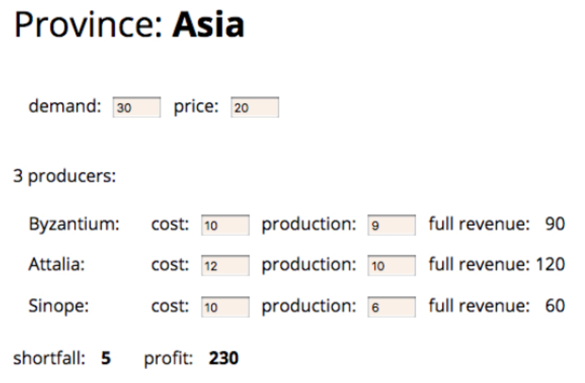
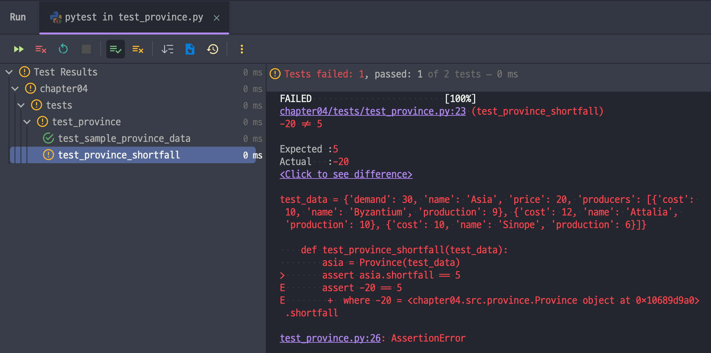

# 4장 - 테스트 구축하기

가치있는 리팩터링을 위해서는 불가피한 실수 대비용 완충재가 필요하다. 그것이 테스트 스위트(_test suite_)이다. 책에서 소개하는 리팩터링 대다수는 테스트 스위트로 검증하길 제안한다. 왜
좋은지 저자의 설명을 요약해보자.

## 4.1 자가 테스트코드의 가치

프로그래머는 코드 짜는 것보다 디버깅하는데 시간을 많이 쓴다. 버그는 몇줄 그냥 고치고 끝인데, 그 여정이 매우 길다. 그리고 버그 잡다가 또 버그가 생긴다. 마틴 파울러도 일하면서 테스트코드를
담기로 했는데, 이 때 자동화가 뒷받침되게끔 각잡고 하자고 마음먹은 후 이렇게 결심했다:

> [!TIP]
> 모든 테스트는 완전 자동화. 결과도 스스로 검사되게끔.

이걸 하니까 회귀 버그 잡는것에 시간을 거의 덜 쏟았다.

> [!NOTE]
> 테스트 스위트는 버그검출 도구다. 버그를 찾는 시간을 대폭 줄여준다.

켄트 백과 에릭 감마[^1]가 비행기 타고 날아가면서 뚝딱 만든 프로그램이 있다. 그게 저 유명한 JUnit이다. `xUnit` 식구들 의 영향을 받은 `unittest`가 파이썬의 기본 테스트
검출기고, 내가 쓰는 `pytest` 는 파이썬 스러운 성향을 더 띈다.

테스트 작성법을 알아야 하고, 테스트를 자동화할 수 있어야 하고, 테스트를 처음부터 짜고 쌓아올라가는 편이 좋다[^2]. 내가 만드는 기능의 계약을 테스트로 구성하고(이 때 테스트 run하면
당연히 Fail이다. 코드베이스가 없거나 바뀐 조건에서 패스하는거니까), 코드베이스를 고치고 테스트를 Pass로 바꾼다. 그리고 리팩터링을 여기서 적용.

## 4.2 테스트할 샘플 코드

이런 사진이 있는데 비즈니스로직만 먼저 짜고 테스트해보자.



예시코드는 `src` 디렉터리에, 테스트코드는 `tests` 디렉터리에 추가한다.

## 4.3 첫 번째 테스트

자바스크립트에선 Mocha를, 나는 pytest를 써서 테스트한다. 픽스처를 구성하고...

```python
@pytest.fixture(name="test_data")
def sample_province_data():
    return {
        "name": "Asia",
        "producers": [
            {"name": "Byzantium", "cost": 10, "production": 9},
            {"name": "Attalia", "cost": 12, "production": 10},
            {"name": "Sinope", "cost": 10, "production": 6},
        ],
        "demand": 30,
        "price": 20,
    }
```

```python
def test_sample_province_data(test_data):
    assert Province(test_data)
```

테스트하면 끝.

```python
def test_province_shortfall(test_data):
    asia = Province(test_data)
    assert asia.shortfall == 5
```

값이 뻔하더라도, 일부러 고장내본다. shortfall 연산을 엉망으로 만들면 하나는 깨진다.



여기서 마틴 파울러의 팁 하나.

> [!TIP]
> 자주 테스트하시오.
> 작성중인 코드는 최소 몇 분 간격으로 테스트하시오.
> 적어도 한 번은 전체 테스트를 돌려보시오.

이번에 uvicorn 공부하면서 전체 테스트 케이스가 600개 언저리였고 다 돌리는데 1분 10초 정도 걸렸다(M3 Pro 기준). 아무튼 자주 돌리기.

패스하면 초록막대, 페일나면 빨간막대인 건 너무 유명하다. 마틴 파울러는 여기에 더해서 테스트가 하나라도 빨간막대면 리팩터 하면 안된다고 조언한다. 차라리 이전상태(다 패스하던)로 돌아가서 재작업하길 주문한다.

## 4.4 테스트 추가하기

테스트는 위험요인을 기준으로 테스트 해야한다. 읽고쓰는 저렴한 테스트보다 가장 걱정되는 부분을 집중해서 테스트하는게 더 가치있다.

두 번째 팁.

> [!TIP]
> 완벽하게 만드느라 테스트를 못 돌릴거면, 불완전한 테스트라도 작성해 실행하는 게 낫다.

```python
def test_province_profit(test_data):
    asia = Province(test_data)
    assert asia.profit == 230
```

이 테스트는 실제 계산결과 `230`을 넣고 테스트한거다.

그런데 책에서 말하는 바는 픽스처가 각 테스트별로 별개로 쓰이길 바랐다. "테스트끼리 상호작용하게 하는 공유 픽스처"를 만들지 말라는 것.

그럼 scope를 `function` 으로 돌리면 매번 생기니, `beforeEach` 와 유사하게 행동한다.

## 4.5 픽스처 수정하기

테스트 시 픽스처를 쓰고 세터로 픽스처 내의 내용을 바꾸는 경우, 이건 테스트가 필요하다.

그러니까 아래와 같은 경우를 의미한다:

```python
def test_change_production(test_data):
    asia = Province(test_data)
    asia.producers[0].production = 20

    assert asia.shortfall == -6
    assert asia.profit == 292
```

표준 픽스처를 취해서, 테스트를 돌리고 검증한다. (Arrange-Act-Assert 라 하든 Given-When-Then이라 하든, Setup-Exercise-Verify라 하든...)
핵심은 초기 작업 중 공통 부분을 픽스처화 해서 "초기화"를 잘 하고 테스트를 격리시키라는 말.

[^1]: GoF 의 그 사나이.
[^2]: 그게 안 된다면 레거시 코드 활용 전략에서 제시하는 테스트 추가용 기법을 배우면 좋겠다. <br /> https://m.yes24.com/Goods/Detail/64586851