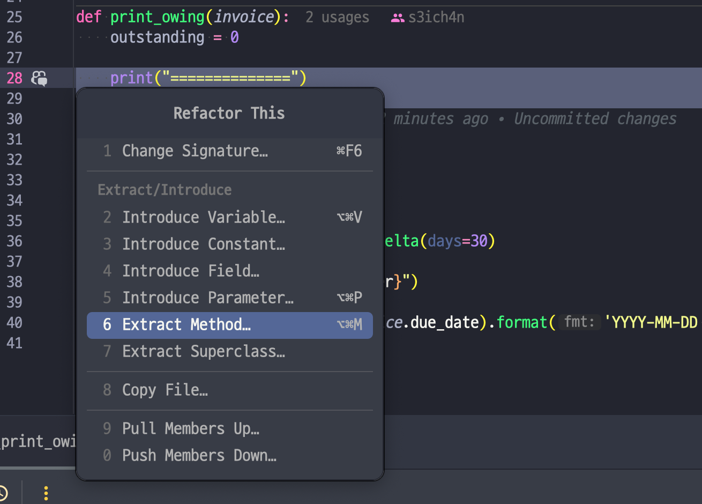
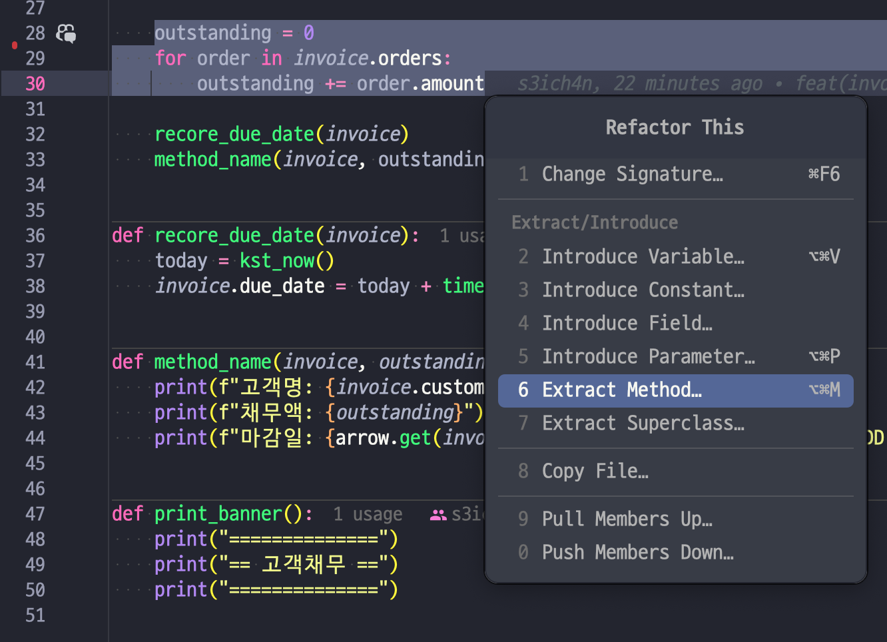
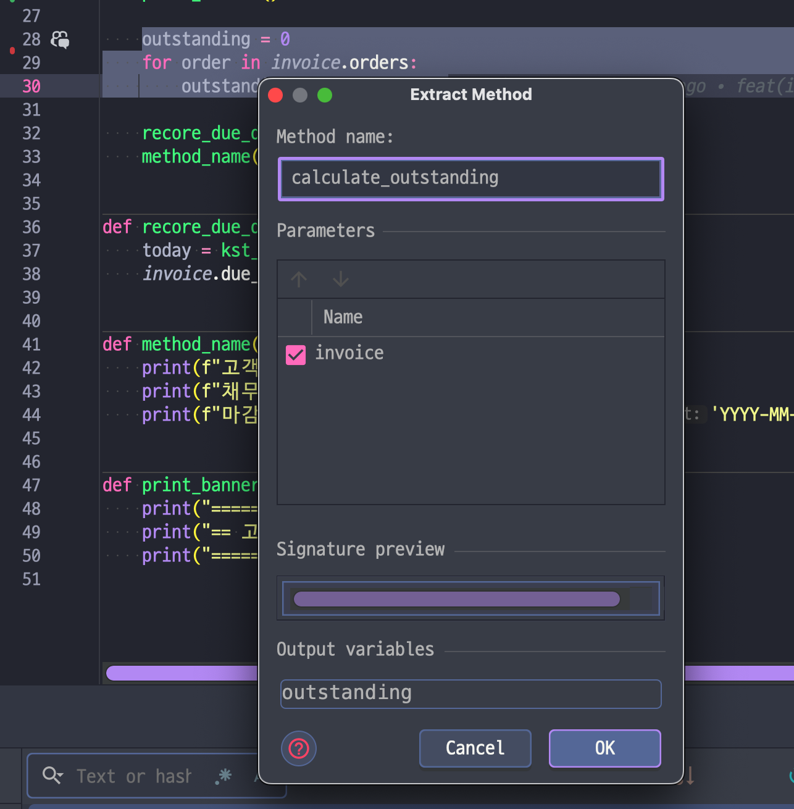

# 6.1 함수 추출하기

_Extract Function_

## 개요

Before

```python
def print_owing(invoice):
    print_banner()

    outstanding = calculate_outstanding()

    print(f"고객명: {invoice.customer}")
    print(f"채무액: {outstanding}")
```

After

```python
def print_owing(invoice):
    print_banner()

    outstanding = calculate_outstanding()
    print_details(outstanding)
    
    def print_details(outstanding):
        print(f"고객명: {invoice.customer}")
        print(f"채무액: {outstanding}")

```

> ![TIP]
> 반대 리팩터링: 함수 인라인하기 (6.2절)

## 배경

코드 조각을 찾고 무슨 일을 하는지 파악 후 독립된 함수로 추출하고 목적에 맞는 이름을 붙임

코드를 언제 독립된 함수로 묶는가?
- 목적과 구현을 분리하는 방식으로 접근
- "이게 무슨일을 하지?" 싶은 부분을 함수로 빼고 "무슨 일"을 함수 이름으로 붙임

이름을 잘 지어야 되는데, 그건 계속 연습하기

긴 함수를 리팩터할 때는 코드 덩어리 처음에 목적을 설명하는 주석이 있을 것임. 그걸 토대로 이름짓기.

## 절차

1. 함수를 새로 만들고 목적을 잘 드러내는 이름 붙이기('뭐하는지' 이름 붙이기)<br />
→ 함수로 뽑아서 목적이 더 잘드러나면 빼기. <br />
    이름이 안 떠오르면 되돌리기. <br />
    하면서 효과가 작으면 다시 인라인하기. (비즈니스 로직의 복잡성을 체크하기) <br />
2. 추출할 코드를 원본 함수에서 복사하여 새 함수에 붙여넣기
3. 추출할 코드 중 원본 함수의 지역변수를 참조하거나 추출한 함수의 유효범위를 벗어나는 변수를 점검하기. 있다면 매개변수로 전달하기<br />
→ 원본함수의 중첩함수로 추출할 땐 문제 발생 X <br />
   함수 내의 지역변수와 매개변수를 모두 인수로 전달 <br />
   사용은 하는데 값이 안 바뀌는 변수를 이렇게 처리함<br />
→ 추출한 코드에서만 쓰는 변수가 추출한 함수 밖에 선언되어 있다면 추출한 함수 안에서 선언하도록 수정<br />
→ 추출한 코드 안에서 값이 바뀌는 변수 중 값으로 전달하는 것은 주의하여 처리하기.<br />
   이런 변수가 하나뿐이라면 추출한 코드를 질의 함수로 취급해서 그 결과(반환값)를 해당 변수에 대입
→ 추출한 코드에서 값을 수정하는 지역변수가 너무 많은 경우?<br />
   함수 추출을 멈추고 변수 쪼개기(9.1절), 임시 변수를 질의 함수로 바꾸기(7.4절) 같은 리팩터링을 적용해서 변수를 쓰는 코드를 단순하게 바뀌보기
4. 컴파일하기
5. 원본 함수에서 추출한 코드 부분을 새로 만든 함수를 호출하는 문장으로 바꾸기 (i.e., 추출한 함수로 일을 위임)
6. 테스트하기
7. 다른 코드에 방금 추출한 것과 똑같거나 비슷한 코드가 없는지 살펴보기. 있다면 방금 추출한 새 함수를 호출하도록 바꿀지 검토하기(인라인 코드를 함수 호출로 바꾸기(8.5절))<br />
→ 중복코드, 비슷한 코드를 찾아주는 리팩터 도구로 확인하기(젯브레인스 제품군은 다 되던듯?)

이런 건 IDE에서도 해준다!





## 예시 - 유효범위를 벗어나는 변수가 없을 때

그냥 옮기면 그만. 근데 이름이 중요하다. 그걸 잘 지어야 함 (8aa22384)

## 예시 - 지역변수를 사용할 때

변수를 쓰지만 다른 값을 다시 대입할 일이 없으면? 그냥 매개변수로 넘기기 (ee1cb380)

지역 변수가 (배열, 레코드, 객체와 같은) 데이터 구조라면? 똑같이 매개변수로 넘기고 필드값 수정.

## 예시 - 지역변수의 값을 변경할 때

> ![NOTE]
> 일단 임시변수만 살펴봅시다.

매개변수에 값을 대입하는 코드를 발견하면? 변수를 쪼개서(9.1절) 임시 변수를 새로 만드록 그 변수에 대입

임시 변수의 종류:
1. 변수가 추출된 코드 안에서만 쓰일 때 - 추출된 코드 안에서만 쓰임
2. 변수가 초기화되는 곳과 실제로 쓰는 곳이 떨어져있을 때 - 문장 슬라이드하기(8.6절)
3. (특이 케이스) 변수가 추출한 함수 밖에서 쓰일 때 (b27bca08)

## 번외 - 값을 반환할 변수가 여러 개라면?

추출할 코드를 다르게 재구성하는 방향으로 처리 (마틴 파울러는 함수는 값 하나만 리턴하는 것을 선호해서, 각각을 반환하는 여러개의 함수로 만듦)

굳이 해야한다면 값을 레코드로 묶어서 반환하거나, 임시 변수 추출 작업을 다른 방식으로 처리하는게 낫다고 판단 (질의 함수로 바꾸기 (7.4절), 변수 쪼개기(9.1절))

다른 문맥으로 옮겨야 한다면 중첩함수로 추출 후 왔다갔다 해보기(어차피 테스트 되니까).