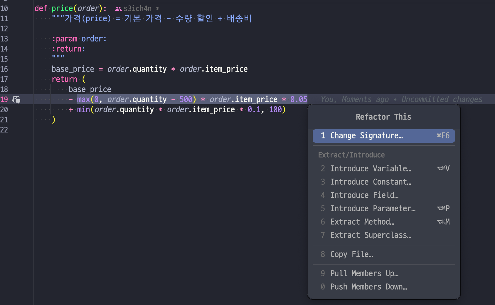
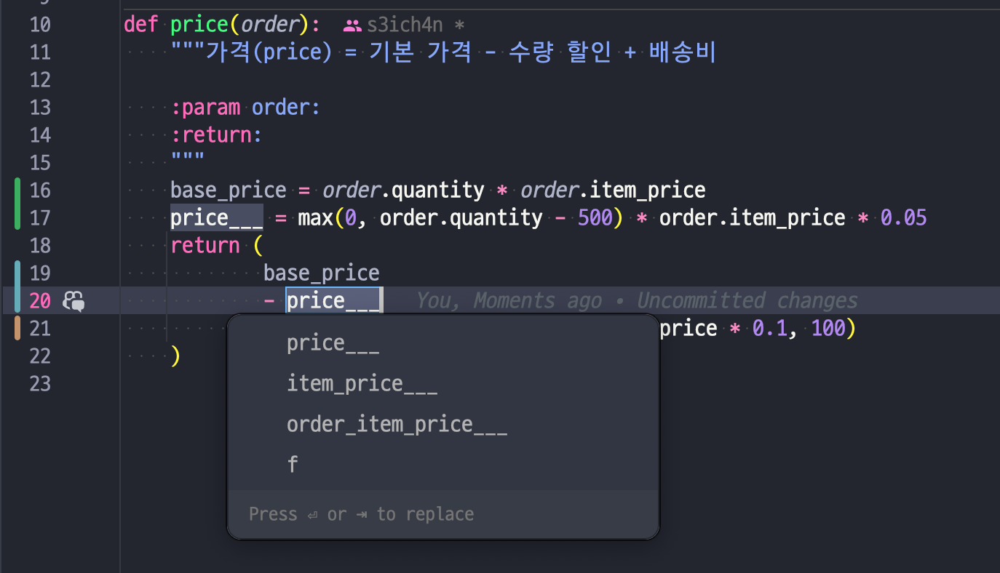

# 6.3 변수 추출하기

_Extract Variable_

## 개요

Before

```python
return order.quantity * order.item_price -
    max(0, order.quantity - 500) * order.item_price * 0.05 +
    min(order.quantity * order.item_price * 0.1, 100)
```

After

```python
base_price = order.quantity * order.item_price
quantity_discount = max(0, order.quantity - 500) * order.item_price * 0.05
shipping = min(base_price * 0.1, 100)

return base_price - quantity_discount + shipping
```

## 배경

로직이 너무 복잡하면 지역변수로 표현식을 쪼개자. 이러면 디버깅에도 도움이 된다. 브레이크포인트를 걸든, 상태 출력을하는 문장을 뿌리든.

변수 추출을 고려하고 있다면 표현식에 이름이 필요하단 말이다. 이름에 필요한 문맥도 알아봐야한단 뜻이다.
만일 현재 함수 내에서만 이게 의미가 있다면 변수로 추출하는 것이 좋다.
그런데 함수 밖을 벗어난 문맥에서 쓰이면 넓은 범위에서 통용되는 이름을 생각해야한다. 이러면 함수로 추출하란 뜻.

그런데 이런 식으로 이름이 통용되는 문맥이 넓어지면 할 일이 늘어난다. 그렇다면 이 임시 변수를 질의 함수로 바꾸기(7.4절)을 적용하기 전까지 내버려준다.
클래스 내부의 코드를 다룰 때는 함수 추출하기(6.1절)을 쉽게 할 수 있다

## 절차

1. 추출하려는 표현식에 부작용이 없나 확인한다.
2. 불변 변수를 하나 선언하고, 이름을 붙일 표현식의 복제본을 대입한다.
3. 원본 표현식을 새로 만든 변수로 교체한다.
4. 테스트한다
5. 표현식을 여러 곳에서 사용한다면 각각을 새로 만든 변수로 교체한다. 바꿀 때마다 테스트한다.

## 예시

계산식을 살펴보자.

한줄 바꾸고, 테스트하고. 





또 한줄 바꾸고. 반복.

이걸 해주는 기능이 있다. 이럴 때 쓰는거구나.

