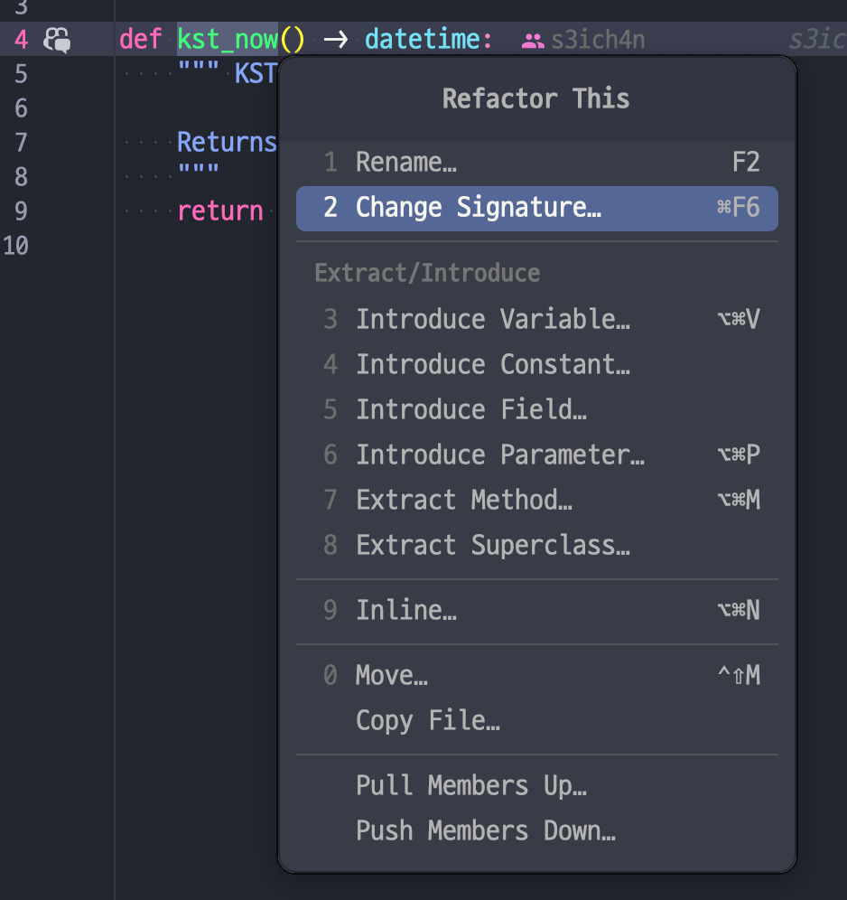
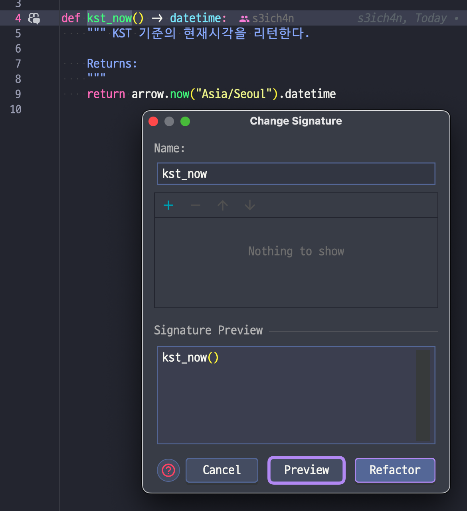

# 6.5 함수 선언 바꾸기

_Change Function Declaration_

다른 이름:

- 함수 이름 바꾸기 (_Rename Function_)
- 시그니처 바꾸기 (_Change Signature_)

## 개요

Before

```python
def circum(radius):
    ...
```

After

```python
def circum(radius):
    ...
```

## 배경

함수는 프로그램을 작은 부분으로 나누는 수단이다. 함수 선언은 각 부분이 맞물려 돌아가는 방식을 의미하며, 소프트웨어 시스템을 조립하는 연결부다.
이런 연결부를 잘 정의하면 새 부분을 추가하기 쉬워진다.

이 연결부를 잘 만들기 위해선 이름을 잘 지어야한다.
좋은 이름을 떠오르면 좋겠지만 한 번에 되기도 힘들고, 일단 대충하자 라는 유혹에 들 수 있다.
그러면 곤란하다. 나중에 그 코드를 볼때 또 고민해야 됨.

> ![TIP]
> 좋은 이름을 떠올리는 효과적인 방법 - 주석으로 함수의 목적을 설명해보기
> 
> 하다보면 주석으로 이름을 지을 수 있다

매개변수도 마찬가지다. 이는 함수가 외부 세계와 통신하는 방법을 정의한다. 매개변수는 함수를 사용하는 문맥을 설정한다.

문맥에 맞게, 활용범위를 넓게 고려하면 다른 모듈과의 결합도 끊을 수 있다. 모듈 숫자가 줄어들면 무언가를 수정할 때 머리에 담아둬야 하는 내용도 적어진다.

매개변수 잘 고르기는 규칙 몇 개로 표현할 수도 없다. 따라서 정답이 없다! 지금 이 방법도 결국 코드를 요구사항에 맞게 계속 잘 바꾸도록 하는 방법일 뿐이다.

E.g., 대여한지 30일이 지났는지를 기준으로 지불기한 지남 여부를 판단하는 메소드

- 매개변수로 지불 객체를? 마감일을?
- 만약 지불 객체를 하면 인터페이스와 결합되지만 "지불"의 여러 속성에 접근하기 쉽다.
    - 이쪽의 요구사항이 더 많거나 필요하면 이 함수가 좋겠다. 캡슐화 수준이 높아지니까.

## 절차

두 가지 절차를 소개한다. '간단한 절차'가 적합할 때가 있고 '마이그레이션 절차'를 써야할 때가 있다.
이걸 할 땐 변경사항을 보고 함수 선언과 호출문을 한번에 바꿀 수 있나 각을 본다.
되겠다 싶으면 간단한 절차로, 아니다 싶으면 마이그레이션 절차를 수행한다.
마이그레이션 절차를 쓰면 호출하는 곳이 많거나, 복잡하거나, 호출 대상이 다형 메서드거나, 선언을 복잡하게 바꿀 때 쓰인다.

### 간단한 절차

1. 매개변수 제거를 윈한다면 함수 본문에서 제거 대상 매개변수를 참조하고 있는 곳이 없나 확인한다
2. 메소드 선언을 원하는 형태로 바꾼다
3. 기존 메소드 선언을 참조하는 부분을 모두 찾아서 바뀐 형태로 수정한다
4. 테스트한다

변경할게 둘 이상이면 나눠서 처리하는 게 낫다. 이름 변경과 매개변수 추가를 다 하고싶다면, 독립적으로 처리한다.
그러다 문제가 생기면 작업을 되돌리고 '마이그레이션 절차'를 따른다

### 마이그레이션 절차

1. 이어지는 추출 단계를 수월하게 만들어야 한다면 함수 본문을 리팩터한다. (적절하게)
2. 함수 본문을 새로운 함수로 추출(6.1절) 한다. <br />
→ 새로 만들 함수 이름이 기존 함수와 같다면 검색하기 쉬운 임시이름을 붙여둔다
3. 추출한 함수에 매개변수를 추가해야 한다면 '간단한 절차'를 따라 추가한다
4. 테스트한다
5. 기존 함수를 인라인(6.2절)한다
6. 임시로 붙여둔 이름을 원래 이름으로 돌려놓는다
7. 테스트한다

상속구조 아래의 메소드를 변경할 때는 다형 관계인 다른 클래스에도 변경이 반영되어야 한다.
이건 상황이 복잡하므로 간접 호출 방식으로 우회(중간단계 활용)을 하기도 한다. 일종의 포워딩...

단일 상속 구조라면 전달 메소드를 슈퍼 클래스에 정의한다. 그게 안 되면 전달 메소드를 구현클래스에 모두 추가해야한다.

공개 API를 리팩터링 할 때는 새 함수를 추가하고 다름 이랙터링을 멈출 수 있다.
이 때 기존함수를 _deprecation_ 예정으로 두고 새 함수로 이전하기 전까지 기다렸다가, 이전이 끝나면 바로 지운다.

## 예시 - 함수 이름 바꾸기

```python
def circum(radius):
    return 2 * math.pi * radius
```

이런게 있으면

```python
def circumference(radius):
    return 2 * math.pi * radius
```

... 이렇게 바꾼다. PyCharm에선 F2를 누르면 그게 된다.

매개변수 추가 제거도 된다. 




유일한 단점은 한 번에 바꿔야 한다는 점이다.
수정할 게 많거나, 여러 클래스에 두루 정의되어 있지만 특정 기능만 바꾸려는 경우는 조금 골치아프다. 그럴 땐...

## 예시 - 함수 이름 바꾸기(마이그레이션 절차)

```python
def circum(radius):
    return 2 * math.pi * radius
```

이거를...

```python
def circum(radius):
    return circumference(radius)


def circumference(radius):
    return 2 * math.pi * radius
```

...로 이전 함수를 인라인(6.2절) 한다.

하나를 바꿀 때마다 테스트하면서 `circumference` 로 계속 바꿔나간다. 다 바꿨으면 `circum`은 사라지는 것.

API나 이런 부분도 처리할 때 `deprecated` 힌트를 두고 바꿔나간다.

## 예시 - 매개변수 추가하기

예약에서 우선순위 큐를 지원하라는 요구사항이 들어옴
이 때 일반 큐와 우선순위 큐를 각각 지정해주는 매개변수를 넣는다고 가정
